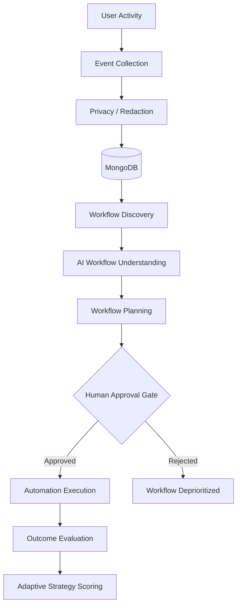

# WorkFlowOS

**AI-assisted workflow automation system that discovers repetitive cross-application patterns from structured activity and executes them through an approval-gated planning engine.**

WorkFlowOS observes routine user interactions non-invasively, identifies repeating multi-step action sequences across sessions using local sequence alignment, synthesizes declarative workflow plans using LLM semantics with deterministic fallbacks, and executes approved steps through a hierarchical multi-strategy automation engine (`API` → `Integration` → `Semantic UI` → `Browser` → `Manual`). All mutating actions require explicit human approval, unknown capabilities fail closed, and runtime receipts feed back into an adaptive strategy scoring loop.

---

## Why WorkFlowOS?

Knowledge workers spend hours daily executing repetitive routines across disconnected tools—copying data between emails, CRMs, spreadsheets, and chat channels. Existing automation solutions suffer from fundamental friction:

* **Manual authoring overhead**: Traditional RPA and script-based tools require users to manually record brittle coordinate clicks, configure XPath selectors, or write custom glue code.
* **Invisible workflows**: Organizations often cannot identify which processes are actually repetitive or worth automating without tedious time-tracking audits.
* **Brittle execution**: Coordinate- and selector-based automations break when application layouts shift, elements re-render, or network latency causes timing mismatches.
* **Safety & privacy risks**: Many experimental "desktop AI agents" capture continuous desktop video streams, log keystrokes, or grant language models unconstrained execution authority over user systems.

**WorkFlowOS approaches the problem differently**: It separates observation from execution, replaces invasive video capture with non-invasive window and semantic event logging, uses algorithmic sequence alignment to discover recurring patterns, restricts the AI to semantic interpretation, enforces strict human approval before any state mutation, and selects the most reliable automation strategy available.

---

## How It Works



1. **User Activity**: Routine user actions performed across desktop applications or controlled web interfaces.
2. **Event Collection**: The macOS desktop agent polls frontmost window/app metadata, while web applications emit structured semantic actions (`open_email`, `search_customer`).
3. **Privacy / Redaction**: In-flight sanitization scrubs authentication tokens, credentials, and Luhn-validated payment cards before storage.
4. **MongoDB**: Schema-fluid storage persists sanitized event streams, candidate workflows, execution traces, and learning states.
5. **Workflow Discovery**: Dynamic programming semi-global local alignment and sliding-window n-gram mining extract recurring multi-session sequences.
6. **AI Workflow Understanding**: Google Gemini (or an offline heuristic fallback) infers high-level user intent, assigns semantic names, and extracts parameter roles.
7. **Workflow Planning**: A deterministic 5-tier planner inspects registered capabilities to select the most reliable execution strategy per step.
8. **Human Approval**: A mandatory authorization gate requires explicit operator confirmation before any state-mutating action can proceed.
9. **Automation Execution**: Declarative engine executes approved steps via integration adapters or Playwright browser automation with retry backoff.
10. **Outcome Evaluation**: Post-execution receipts are validated against expected state changes and classified across an 11-category failure taxonomy.
11. **Adaptive Strategy Scoring**: Empirical execution evidence updates bounded strategy suitability scores, steering future plans away from flaky connectors.

---

## Key Features

* **Workflow Discovery from Repeated Activity**: Mines recurring multi-step workflows from event streams without requiring predefined templates.
* **Multi-Session Sequence Analysis**: Validates that patterns recur across distinct user sessions rather than isolated single-session bursts.
* **Semi-Global Local Sequence Alignment**: Matches workflow patterns embedded inside longer, noisy sessions, tolerating prefix/suffix noise, insertions, omissions, and step transpositions.
* **AI-Assisted Workflow Understanding**: Uses Google Gemini to translate raw event verb sequences into human-readable workflows with typed parameters and semantic step descriptions.
* **Offline Deterministic Fallback**: Automatically falls back to rule-based heuristic workflow synthesis when LLM APIs are unconfigured or unavailable.
* **Structured Declarative Workflow Model**: Represents workflows as versioned JSON/Pydantic schemas with typed inputs, preconditions, timeouts, and idempotency keys.
* **Human-in-the-Loop Approval Gate**: Halts all mutating operations (`update_customer`, `send_message`, `post_message`) until an operator explicitly approves them.
* **Fail-Closed Capability Registry**: Enforces an explicit capability manifest; unregistered actions or unknown applications fail closed and cannot execute silently.
* **Hierarchical Strategy Planner**: Dynamically selects execution strategies across 5 tiers: `API` → `Integration Adapter` → `Semantic UI` → `Browser Automation` → `Manual Intervention`.
* **Playwright Browser Automation**: Drives headless/headed browser sessions across web applications when direct API or integration adapters are unavailable.
* **Sensitive Data Redaction Engine**: Scrubs API tokens (`ghp_`, `ya29.`, `sk-`, `AKIA`), bearer headers, private keys, emails, and Luhn-validated credit card PANs.
* **Authoritative Collection Kill-Switch**: The `ACTIVITY_COLLECTION_ENABLED` flag immediately stops client-side collection and drops incoming events at the ingestion gate.
* **Execution State Tracking**: Maintains transactional lifecycle states (`PENDING`, `RUNNING`, `COMPLETED`, `FAILED`, `CANCELLED`) with step-level duration and receipt capture.
* **11-Category Failure Taxonomy**: Classifies execution failures deterministically (`TIMEOUT`, `AUTHENTICATION`, `AUTHORIZATION`, `NETWORK`, `VALIDATION`, `TARGET_NOT_FOUND`, `UNSUPPORTED_ACTION`, `RATE_LIMIT`, `INTEGRATION_ERROR`, `BROWSER_ERROR`, `UNKNOWN`).
* **Adaptive Strategy Scoring**: Dynamically adjusts strategy preference based on empirical success/failure receipts using a bounded deterministic evidence-weighted adaptive learning/scoring formula ($L \in [0.0, 1.0]$).
* **Automated Regression Test Suite**: 476 backend unit, integration, and benchmark tests verifying discovery, planning, privacy, learning, and safety invariants.

---

## Workflow Discovery

Workflow discovery is the core pattern-detection engine of WorkFlowOS. It operates autonomously on normalized event logs without requiring users to label or record their workflows.

```
Session 1: [ open_email ──► download_attachment ──► search_customer ──► update_customer ──► send_message ]
Session 2: [ open_email ──► search_customer ──► (noise click) ──► update_customer ──► send_message ]
Session 3: [ open_email ──► download_attachment ──► search_customer ──► update_customer ──► send_message ]
                                                  │
                                                  ▼
Discovered Workflow: "Customer Support Request Processing" (Confidence: 0.88, Occurrences: 3)
```

### 1. Event Collection & Session Representation
Events are captured non-invasively (application name, window title, semantic action, timestamp). Events sharing a common `session_id` are grouped and chronologically sorted by parsed ISO-8601 timestamps. Each session is normalized into an ordered list of functional action verbs:
```python
session = ["open_email", "download_attachment", "search_customer", "update_customer", "send_message"]
```

### 2. Repeated Sequence Detection
The discovery engine uses sliding-window n-gram mining (lengths 2 to 10) and pairwise Longest Common Subsequences (LCS) across sessions to identify candidate recurring sequences that meet a configurable minimum support threshold (default: $\ge 2$ distinct sessions).

### 3. Local Sequence Alignment & Noise Handling
Real desktop activity contains interruptions, extraneous clicks, and minor variations. WorkFlowOS employs a **semi-global dynamic programming local alignment** algorithm ($O(m \cdot n)$) with Damerau-Levenshtein transposition awareness:
* **Prefix / Suffix Noise**: Free start and end gaps allow a 5-step workflow to be detected even if buried inside a 50-event session.
* **Insertions**: Unrelated actions between workflow steps (e.g. checking a notification) are penalized as gap insertions rather than aborting the match.
* **Omissions & Transpositions**: Optional steps or adjacent order swaps (e.g. searching CRM before downloading attachment) are scored with controlled edit penalties.
* **Monotonous Loop Suppression**: Low-entropy sequences repeating a single action (e.g. scrolling or repetitive clicking) are automatically filtered out.

### 4. Candidate Ranking & Confidence Scoring
Discovered patterns are evaluated by two transparent, bounded scoring models:

* **Confidence Score** ($C \in [0.0, 1.0]$): Combines 5 orthogonal empirical signals:
  * Repetition Support (weight: 0.30): Number of distinct sessions containing the pattern.
  * Sequence Similarity (weight: 0.25): Average alignment score across matched sessions.
  * Action Diversity (weight: 0.20): Entropy / variety of actions, penalizing repetitive loops.
  * Sequence Length (weight: 0.15): Structural depth and complexity.
  * Session Consistency (weight: 0.10): Proportion of exact replay instances vs. partial matches.

* **Utility Ranking Score** ($R \in [0.0, 1.0]$): Prioritizes candidates for human presentation based on operational impact:
  $$\text{Ranking Score} = 0.30 \cdot C_{\text{confidence}} + 0.25 \cdot F_{\text{fidelity}} + 0.20 \cdot V_{\text{volume}} + 0.15 \cdot I_{\text{impact}} + 0.10 \cdot R_{\text{richness}}$$

Candidates are categorized into quality tiers (`exceptional` $\ge 0.85$, `strong` $\ge 0.70$, `moderate` $\ge 0.50$, `low` $< 0.50$). Subsumed or shadow variants of longer primary patterns are automatically linked and suppressed.

---

## AI Layer

WorkFlowOS strictly separates non-deterministic language model responsibilities from deterministic system execution:

```
┌────────────────────────────────────────────────────────┐
│             Generative AI (Google Gemini)              │
│  - Natural language intent inference                   │
│  - Semantic workflow naming and categorization         │
│  - Variable identification and parameter extraction    │
│  - Offline fallback to deterministic heuristic rules   │
└───────────────────────────┬────────────────────────────┘
                            │ Structured Proposal
┌───────────────────────────▼────────────────────────────┐
│              Deterministic System Engine               │
│  - Capability manifest & schema validation             │
│  - 5-tier strategy selection & fallback planning       │
│  - Human-in-the-loop approval gate enforcement         │
│  - Fail-closed execution & step timeouts               │
│  - Luhn checksum redaction & secret scrubbing          │
│  - Execution state lifecycle tracking                  │
│  - 11-category failure taxonomy classification         │
│  - Bounded evidence-weighted strategy scoring          │
└────────────────────────────────────────────────────────┘
```

* **What the AI does**: Given an observed sequence of event verbs and application metadata, Gemini infers high-level user intent (e.g. classifying `[open_email, download_attachment, update_customer]` as `"Customer Support Request Processing"`), extracts parameter roles (`customer_id`, `attachment_name`), and generates human-readable step descriptions.
* **What the AI NEVER does**: The LLM never executes shell commands, never interacts with operating system APIs, never accesses raw credentials, and never bypasses safety boundaries. All AI outputs must conform to strict Pydantic schemas before entering the planner.

---

## Safety Architecture

Safety is designed into the core system invariants rather than added as an afterthought:

* **Human-in-the-Loop Approval Gate**: All state-mutating operations (`mutating: true`, such as `update_customer`, `send_message`, or `post_message`) require explicit operator authorization before execution. Read-only actions (`read_message`, `search_customer`) can run autonomously only when explicitly configured.
* **Fail-Closed Execution**: Any action not explicitly declared in an application's capability manifest is classified as `UNKNOWN_ACTION`. Unknown actions and unregistered applications are rejected immediately and cannot execute.
* **Capability Registry**: Applications expose explicit manifests declaring supported actions, required parameters, and whether each action is read-only or mutating.
* **Sensitive Data Redaction**: The redaction service sanitizes structured and unstructured payloads before persistence:
  * Platform tokens: `ghp_`, `ya29.`, `sk-`, `AKIA`, JWTs, and private keys.
  * Financial data: Credit card PANs (13–19 digits) validated via the **Luhn checksum algorithm** to eliminate false positives on order IDs.
  * Personal data: Email addresses, phone numbers, and authorization headers.
* **Authoritative Collection Kill-Switch**: The `ACTIVITY_COLLECTION_ENABLED` setting provides an instant kill-switch. When toggled off, the desktop agent halts event emission and backend ingestion endpoints drop payloads immediately.
* **Execution State Validation & Idempotency**: Workflows are assigned unique execution IDs and idempotency tokens. Completed executions cannot be re-executed, preventing duplicate writes.
* **Read-Only Gmail Integration**: The Gmail adapter requests strictly read-only OAuth scopes (`https://www.googleapis.com/auth/gmail.readonly`). WorkFlowOS cannot send, modify, or delete emails in user mailboxes.

---

## Automation Strategy

When an approved workflow is scheduled for execution, the **Intelligent Automation Planner** evaluates every step against a 5-tier strategy hierarchy:

```
Tier 1: API Direct
   ↓  (Direct HTTP/REST call to application service)
Tier 2: Integration Adapter
   ↓  (Registered native adapter, e.g. OAuth connector or SDK)
Tier 3: Semantic UI
   ↓  (Accessibility/DOM-level semantic interaction)
Tier 4: Browser Automation
   ↓  (Playwright headless/headed browser execution)
Tier 5: Manual Intervention
      (Operator manual fallback when automated paths fail)
```

### Strategy Selection Principle
The planner prefers more reliable, stable interfaces (`API` and native `Integration` adapters) over fragile browser or UI automation. Browser automation via Playwright is selected only when no direct programmatic interface is available.

### Playwright Browser Automation
WorkFlowOS implements a functional Playwright executor (`automation/playwright_executor.py`) that drives browser automation across supported web applications (`/demo/email`, `/demo/crm`, `/demo/chat`).

### Realistic Automation Limitations
In real-world environments, browser and UI automations face operational boundaries:
* **DOM Drifts & Layout Changes**: Third-party website redesigns, dynamic element classes, or shadow DOM trees can invalidate selectors.
* **Session Expiry & Authentication**: Expired cookies, session timeouts, or rotated credentials halt execution and require re-authentication.
* **CAPTCHAs & 2FA / MFA**: Automated browser runners cannot solve interactive bot challenges or out-of-band two-factor verification.
* **System Permissions**: Native desktop observation and UI interaction depend on operating system accessibility permissions that can be revoked.

---

## Architecture

```text
workflowOS/
├── agent/                  # macOS activity capture agent (AppKit/Carbon window focus poller)
├── ai/                     # Gemini 2.5 Flash SDK integration with deterministic heuristic fallback
├── automation/             # Declarative execution engine, Playwright runner, and step executors
│   └── planner/            # 5-tier hierarchical strategy planner and capability scorer
├── backend/                # FastAPI application backend (REST routes, database, configuration)
│   ├── discovery/          # Sequence mining, local alignment, pattern ranking, explainability
│   ├── learning/           # Closed-loop outcome evaluation, 11-category failure taxonomy, adaptive scoring
│   ├── privacy/            # Sensitive data redaction engine, retention pruning, kill switch
│   └── routes/             # API endpoints (events, discovery, workflows, execution, integrations)
├── discovery/              # Core algorithmic discovery models (LCS, alignment, confidence, ranking)
├── docs/                   # Architectural specifications, API docs, evaluation reports, demo guides
├── evaluation/             # Phase 15 benchmark harness (10 deterministic scenarios A–J) and metrics
├── frontend/               # Next.js 16 (React 19 + Tailwind CSS) product dashboard
│   ├── src/app/            # App router pages and interactive demo apps (/demo/email, crm, chat)
│   └── src/components/     # Dashboard, Discovery, Workflows, Executions, and Settings views
└── integrations/           # Application capability registry, read-only Gmail OAuth, and mock adapters
```

---

## Tech Stack

| Layer | Technology | Purpose |
|:---|:---|:---|
| **Backend Framework** | FastAPI / Python 3.11 | Asynchronous REST API server and routing |
| **Data Validation** | Pydantic v2 | Strict schema definitions and runtime data validation |
| **Database** | MongoDB / Motor | Document persistence for events, workflows, executions, and learning states |
| **Frontend Framework** | Next.js 16 (React 19) | Server-rendered and interactive client dashboard (App Router) |
| **Styling** | Tailwind CSS v4 | Utility-first responsive design and modern interface tokens |
| **AI Layer** | Google Gemini 2.5 Flash | Semantic workflow understanding via `google-genai` SDK |
| **Fallback AI Engine** | Deterministic Rule Heuristics | 100% offline workflow synthesis when Gemini is unconfigured |
| **Browser Automation** | Playwright | Headless and headed browser execution across web interfaces |
| **Desktop Agent** | PyObjC / AppKit / Carbon | Non-invasive macOS window focus and application switch polling |
| **Token Encryption** | Cryptography (Fernet) | AES-128-CBC + HMAC-SHA256 authenticated credential storage |
| **Testing** | pytest & unittest | Automated test runners for unit, integration, and benchmark suites |
| **Continuous Integration** | GitHub Actions | Automated build, dependency validation, and test execution on push/PR |

---

## Evaluation

WorkFlowOS includes a standalone, deterministic benchmark harness (`evaluation/run.py`) evaluating the end-to-end pipeline against a standardized 10-scenario test matrix (`SCENARIO_A` through `SCENARIO_J`):

* `SCENARIO_A`: Canonical Customer Support sequence (5 actions across 3 distinct sessions).
* `SCENARIO_B`: Repeated workflow with minor step variations (optional attachment download).
* `SCENARIO_C`: Similar but distinct workflows ensuring separate identities (CRM Update vs Order Cancel).
* `SCENARIO_D`: Intermediate noise tolerance (random navigation actions between valid steps).
* `SCENARIO_E`: Short sequence rejection (< 3 steps rejected below threshold).
* `SCENARIO_F`: Single-session occurrence rejection (unrepeated single session rejected).
* `SCENARIO_G`: Multi-session isolation (disjoint sequences across sessions remain unmerged).
* `SCENARIO_H`: Mutating workflow authorization enforcement (mutating actions require approval).
* `SCENARIO_I`: Unknown action fail-closed rejection (`UNKNOWN_ACTION` rejected).
* `SCENARIO_J`: Unknown application ecosystem boundary enforcement.

### Benchmark Results

> **Important**: The results below reflect deterministic evaluation on the included synthetic benchmark dataset. They validate structural correctness, alignment accuracy, and safety boundaries under controlled conditions; they do not represent statistical accuracy across noisy, unconstrained real-world desktop environments.

| Subsystem | Metric | Measured Result | Benchmark Standard |
|:---|:---|:---:|:---:|
| **Workflow Discovery** | Precision | **100.0%** | $\ge 90.0\%$ |
| **Workflow Discovery** | Recall | **100.0%** | $\ge 90.0\%$ |
| **Workflow Discovery** | F1 Score | **1.0000** | $\ge 0.900$ |
| **Pattern Ranking** | Top-1 Accuracy | **87.5%** | $\ge 80.0\%$ |
| **Pattern Ranking** | Mean Reciprocal Rank (MRR) | **0.9375** | $\ge 0.850$ |
| **Explainability Engine** | Audit Coverage | **100.0%** | $100.0\%$ |
| **Automation Planning** | Strategy Selection Accuracy | **100.0%** | $\ge 95.0\%$ |
| **Outcome Evaluation** | 11-Category Taxonomy Accuracy | **100.0%** | $\ge 95.0\%$ |
| **Execution Safety Gate** | Unauthorized Mutation Bypass Rate | **0.0%** | $0.0\%$ |
| **Safety Compliance** | Unknown Action Fail-Closed Rate | **100.0%** | $100.0\%$ |
| **End-to-End Pipeline** | Full 10-Stage Synthetic Run Success | **100.0%** | $100.0\%$ |

*Full evaluation reports and raw timing data are documented in [docs/PHASE_15_REPORT.md](docs/PHASE_15_REPORT.md).*

---

## Testing

The repository contains 476 automated test cases covering discovery algorithms, planning logic, AI synthesis, privacy scrubbing, integration contracts, and regression suites.

### Running Backend Tests

```bash
# Activate virtual environment
source .venv/bin/activate

# Run all backend tests with pytest
pytest backend

# Run with concise progress output
pytest -q backend

# Run via Python's standard unittest runner
python -m unittest discover -s backend -p "test_*.py"

# Run the Phase 15 evaluation benchmark harness
python -m evaluation.run
```

### Running Frontend Checks

```bash
cd frontend

# Run ESLint validation
npm run lint

# Run TypeScript static type checking
npm run type-check

# Run unit tests
npm test

# Build production bundle
npm run build
```

---

## Getting Started

### Prerequisites
* **Python**: 3.11+
* **Node.js**: 18+ (Node 20+ recommended)
* **MongoDB**: A running local MongoDB instance or MongoDB Atlas cluster URI

### 1. Clone & Configure Environment

```bash
git clone https://github.com/rohitt-prog/WorkflowOS.git
cd WorkflowOS

# Copy environment configuration template
cp .env.example .env
```

Edit `.env` to configure your settings:
```dotenv
MONGODB_URI=mongodb://localhost:27017/workflowos
GEMINI_API_KEY=your_optional_gemini_api_key
WORKFLOWOS_CREDENTIAL_KEY=your_32_byte_base64_fernet_key
ACTIVITY_COLLECTION_ENABLED=true
```
*(If no `GEMINI_API_KEY` is provided, the system operates seamlessly using its offline deterministic heuristic fallback).*

### 2. Backend Setup

```bash
python3 -m venv .venv
source .venv/bin/activate
pip install -r requirements.txt

# Start FastAPI server on port 8000
python -m uvicorn backend.main:app --reload --host 127.0.0.1 --port 8000
```

Verify backend health at `http://127.0.0.1:8000/api/health`. Interactive OpenAPI documentation is available at `http://127.0.0.1:8000/docs`.

### 3. Frontend Setup

In a separate terminal window:

```bash
cd frontend
npm install
npm run dev
```

Open `http://localhost:3000` to access the WorkFlowOS dashboard. Interactive demo web applications are accessible at:
* `/demo` — Demo Hub overview
* `/demo/email` — Demo Webmail client
* `/demo/crm` — Demo Customer Relationship Manager
* `/demo/chat` — Demo Team Messaging client

### 4. macOS Desktop Activity Agent (Optional)

To observe active desktop application window switches on macOS:

```bash
source .venv/bin/activate
python -m agent run --interval 1.0
```

---

## Known Limitations

To maintain engineering transparency, the following design boundaries are documented:

1. **Synthetic Benchmark Scope**: Benchmark metrics reflect the included 10-scenario synthetic dataset (Scenarios A–J) designed to verify algorithmic correctness, not real-world enterprise telemetry.
2. **Local Single-User Architecture**: WorkFlowOS is implemented and tested as a single-node system without distributed multi-tenant isolation or worker clustering.
3. **Controlled Integration Scope**: While the Gmail adapter supports live Google OAuth 2.0 (strictly read-only access), CRM and Chat capabilities currently utilize local mock adapters implementing realistic capability schemas.
4. **Non-Invasive Observation Boundaries**: The macOS desktop agent observes window titles and application switch events. It does not perform full screen OCR, pixel analysis, or deep accessibility tree inspection.
5. **UI & Browser Automation Fragility**: Browser executions driven by Playwright are inherently vulnerable to unexpected third-party DOM shifts, element re-renderings, or bot-detection challenges.

---

## Engineering Documentation

* [System Architecture Specification](docs/ARCHITECTURE.md)
* [REST API Reference](docs/API.md)
* [12-Step Demonstration Script](docs/DEMO.md)
* [Phase 15 Benchmark Evaluation Report](docs/PHASE_15_REPORT.md)
* [Release Verification Checklist](docs/RELEASE_CHECKLIST.md)
* [Interview Guide & Technical Architecture FAQ](docs/RESUME.md)
